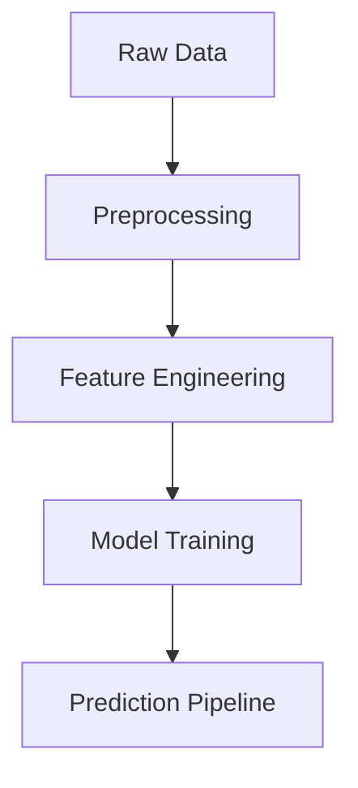

# Data Pipeline Documentation
[← Back to README](../README.md)

## Data Processing Pipeline

### Data Collection
- Customer demographic data
- Purchase history
- Behavioral metrics
- Device usage data

### Data Preprocessing
```python
def preprocess_data():
    # Load raw data
    data = pd.read_csv('../data/data.csv')
    
    # Handle missing values
    data['Social_Media_Influence'].fillna(data['Social_Media_Influence'].mean())
    data['Engagement_with_Ads'].fillna(data['Engagement_with_Ads'].mean())
    
    # Encode categorical variables
    categorical_cols = ['Gender', 'Income_Level', 'Purchase_Category']
    for col in categorical_cols:
        le = LabelEncoder()
        data[col] = le.fit_transform(data[col])
        
    return data
```

### Feature Engineering
- Numerical features scaling
- Categorical encoding
- Feature selection
- Data validation

### Data Flow Diagram

